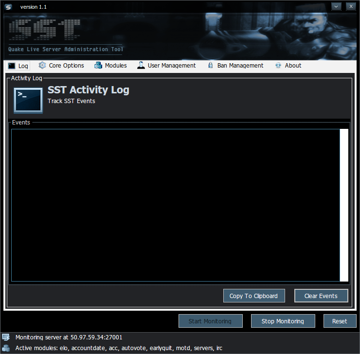

# SynServerTool (SST)

**Official SST website: [http://sst.syncore.org](http://sst.syncore.org)**

SynServerTool is a game server administration tool for id software's
[Quake Live].

The tool extends and in some cases adds new server administration and other
functionality to the game to provide server owners and players alike with a
better game experience.

----------

### A few of the features
Some, but not all of the key features include:

  - Very easy to use, very little configuration required
  - User level management
  - Player ban management
  - Server restrictions
  - Pick-up game mode
  - Multiple administration interfaces (in-game, Internet Relay Chat, GUI)

### Installation/Using SST

- SST requires Microsoft .NET Framework v4.5 or later, if you don't already
have it, [download v4.5.2 from Microsoft, here.](http://www.microsoft.com/en-us/download/details.aspx?id=42642)
- Launch the application (SST.exe)
- If you have not done so, change the QL Account Name and Owner Account Name in
 the Core Options tab.
- When changing options in the UI, be sure to click the *Save* icon.
- Make sure that you have started a Quake Live server and that you are the owner
of the server. Then click the **Start Monitoring** button in the SST application.

### SST Commands
**The full command list is available on the [SST help website, here](http://sst.syncore.org/help)
or as a text file, `sst-commands.txt` that is included with the application.**

Open `sst-commands.txt` in a text editor, or in the SST application, go to the
**About** tab, and click **SST Commands** button.

 - **The modules and options are configured in the user interface.**
 	- The rest of the commands are accessed either in-game or via the IRC module.
 - To get the list of commands that your user level has access to:
	 - `!help`

### Help / Issues

I can be found under the name "syncore" on QuakeNet IRC - irc.quakenet.org - in
the SST channel, #SST. [Click here to connect.](http://irc.lc/quakenet/sst)
The preferable method of contact would be for you to open up an [issue] on
GitHub.

### Notes, misc, etc.

I originally created this tool as a proof of concept and as a .NET learning experience prior
to a similar tool, minqlbot, being open sourced. I was not aware that that tool would be open sourced
when I made this; that tool is probably more actively developed, etc.
I make no claims about this tool's reliability, accuracy, or anything else, so take it for what it's worth :smiley:
Any suggestions are welcome.

License
----
See [LICENSE.md]

[LICENSE.md]:https://github.com/syncore/SST/blob/master/LICENSE.md
[issue]:https://github.com/syncore/SST/issues
[Quake Live]:http://www.quakelive.com